This is my notes for preparing for SAA-C02 exam.
# SAA C02 Notes

I have created notes as kind of MindMap diagram for the AWS services in scope to remember certain features for the preparation of the exam.

## API Gateway
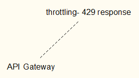

## Aurora
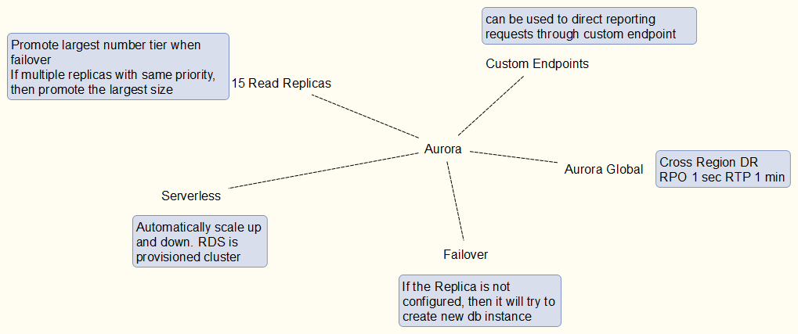

## CloudFormation
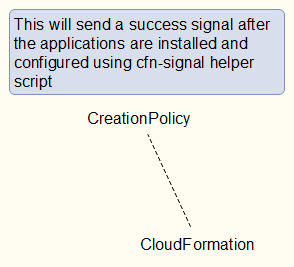

## CloudFront
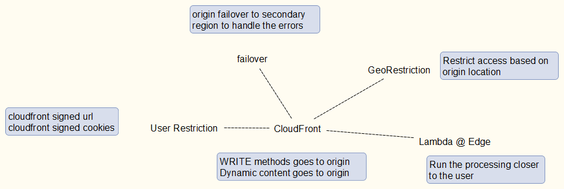

## CloudWatch
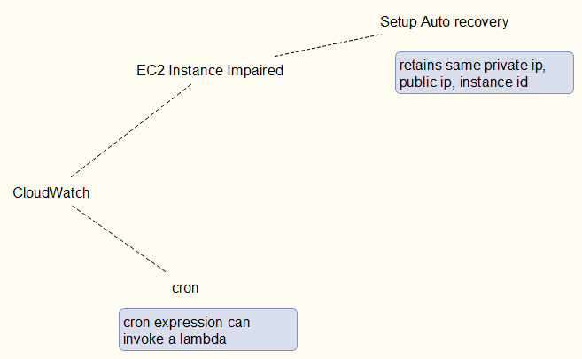

## Containerization
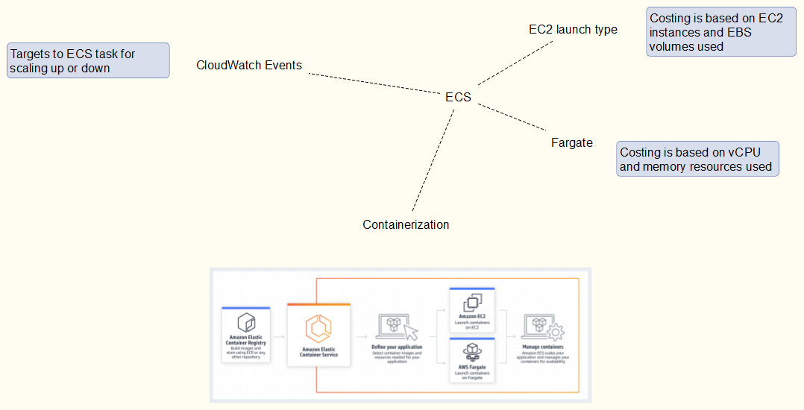

## DynamoDB
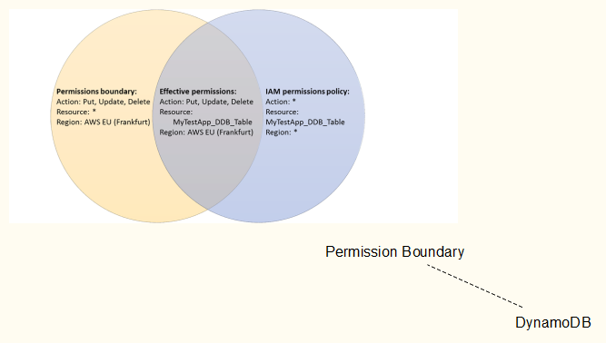

## EC2
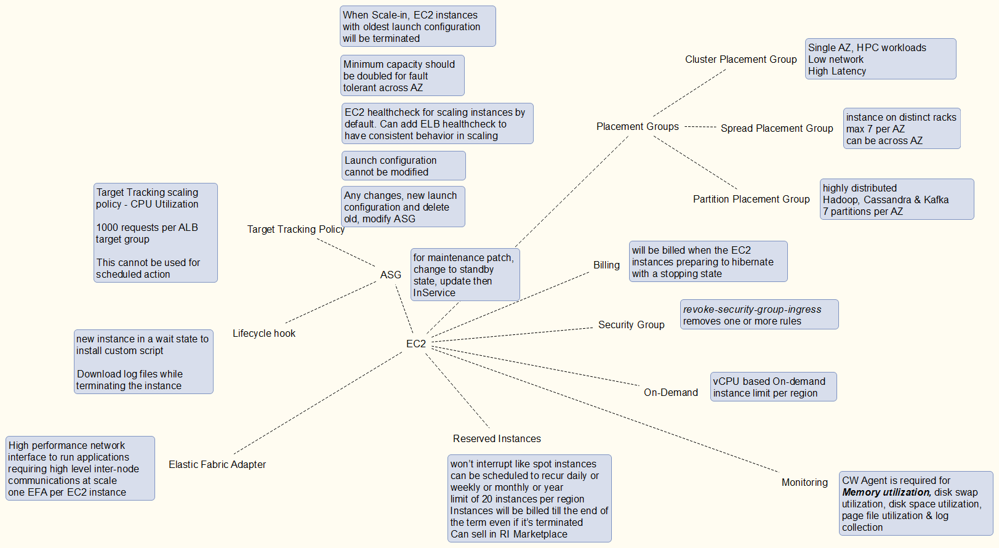

## ElasticCache
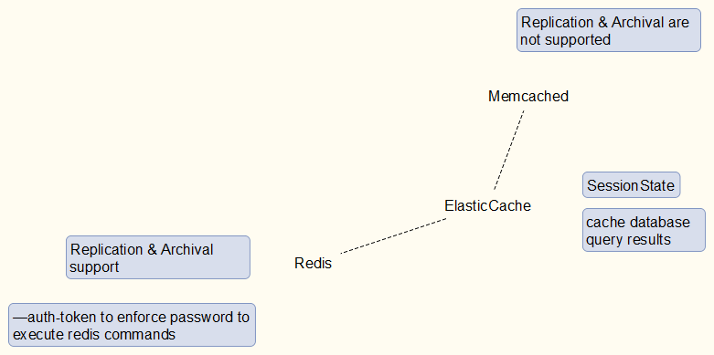

## ELB
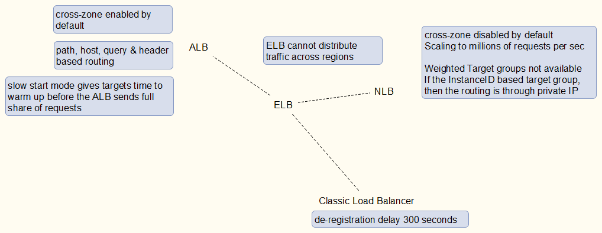

## Governance
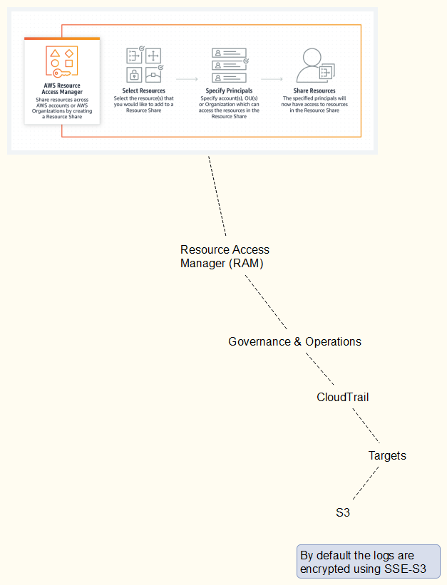

## Hybrid-Network
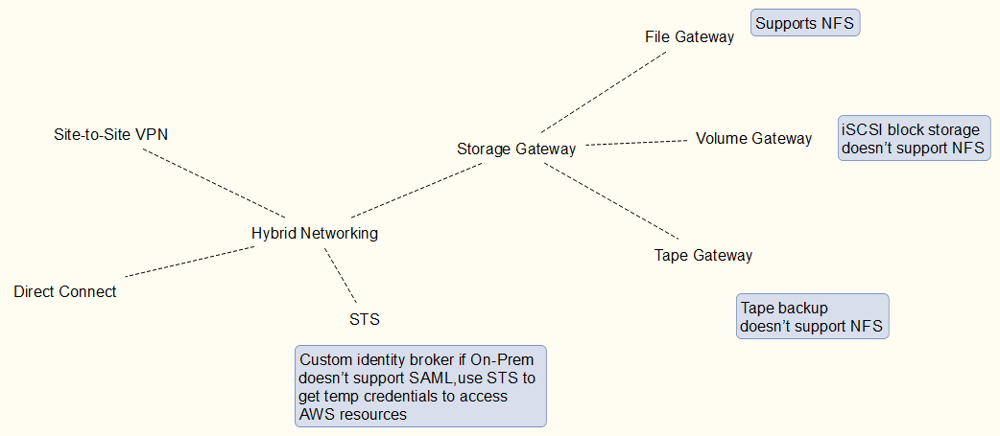

## IAM
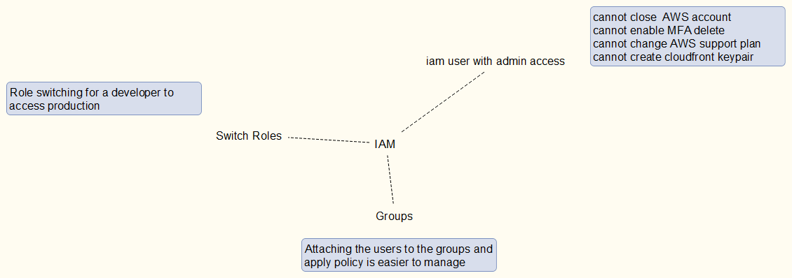

## Lambda
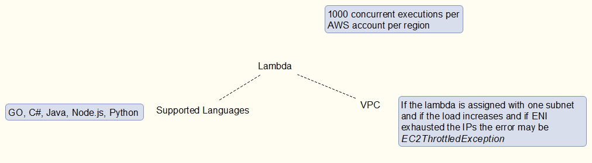

## Messaging
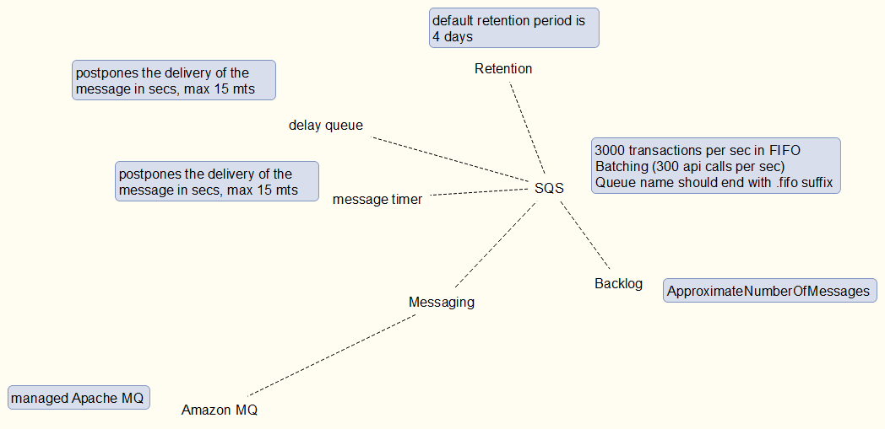

## RDS
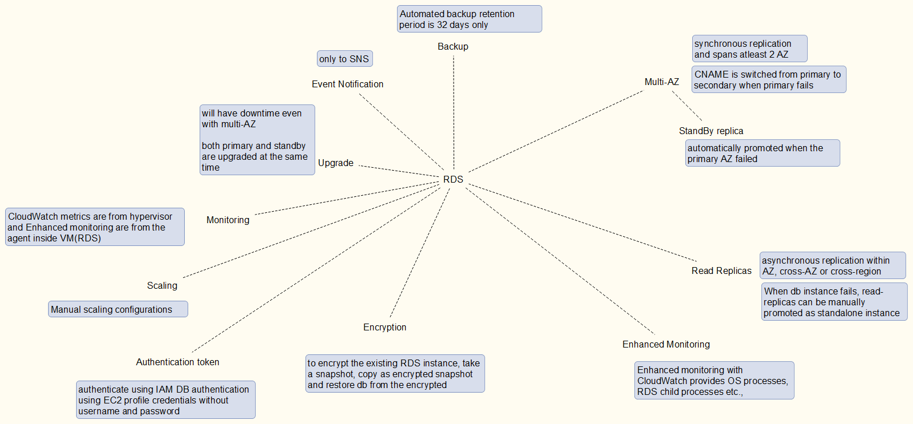

## Route53
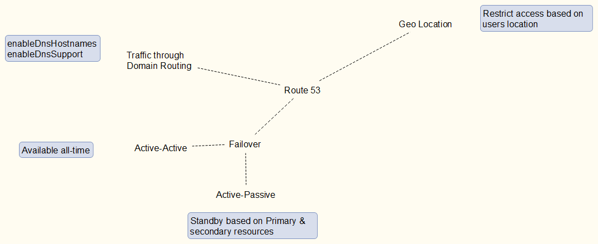

## Storage
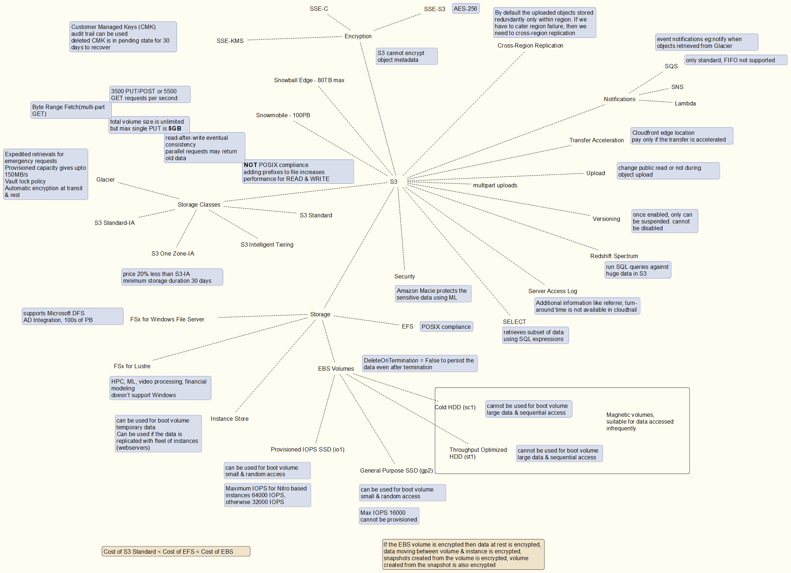

## Stream & BigData
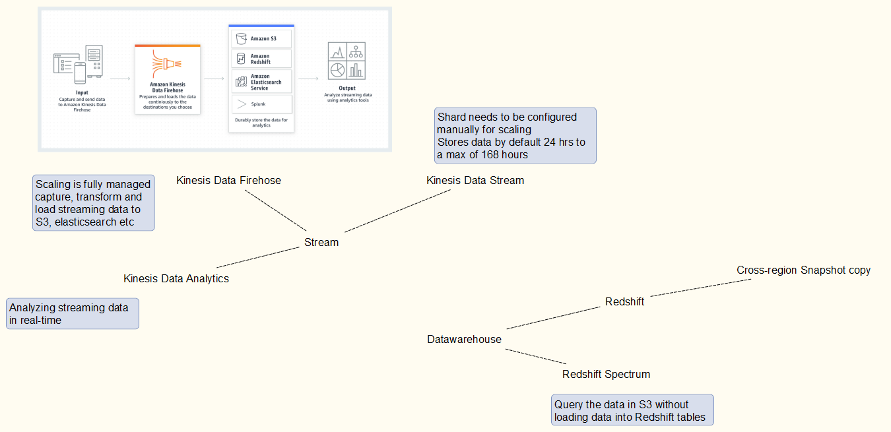

## VPC
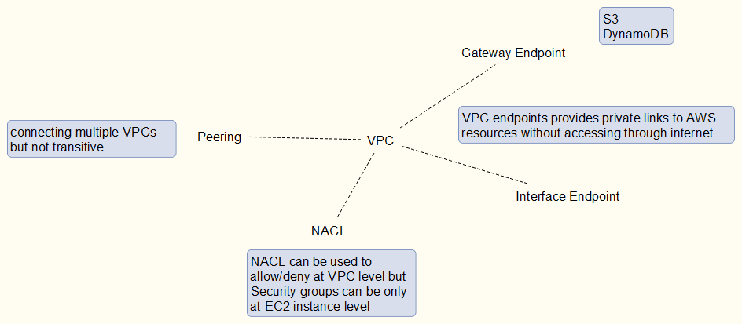
