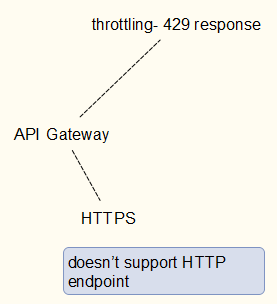
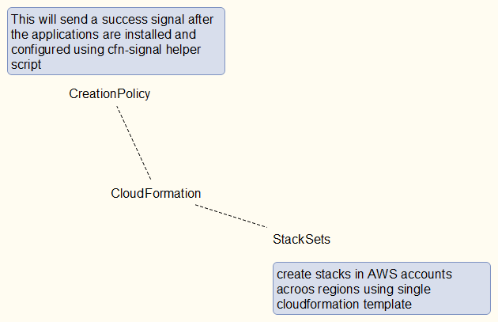
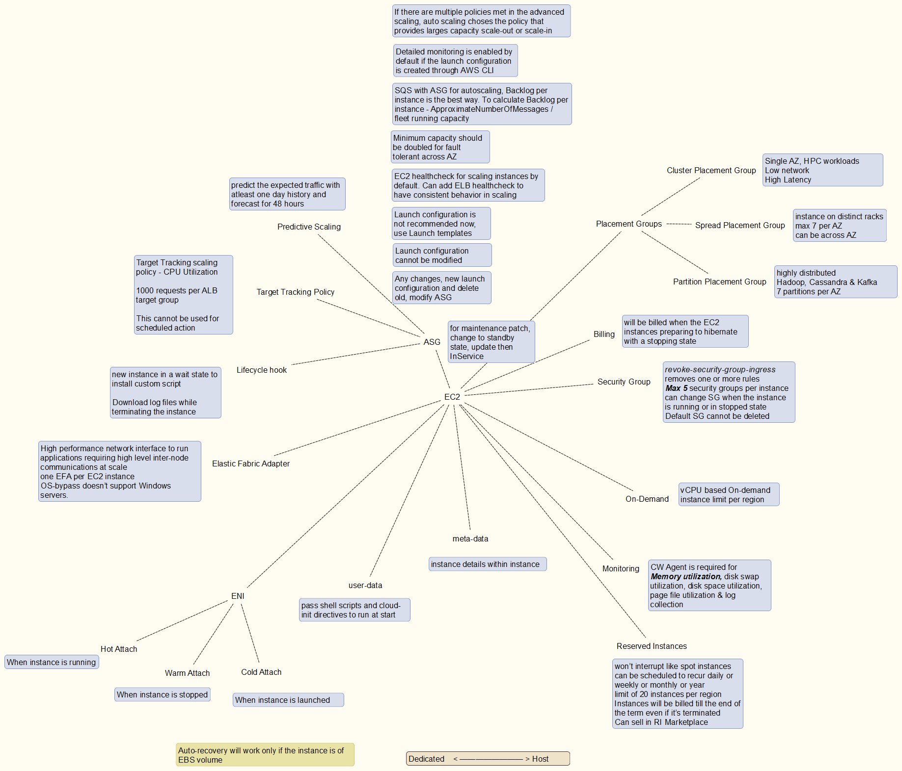
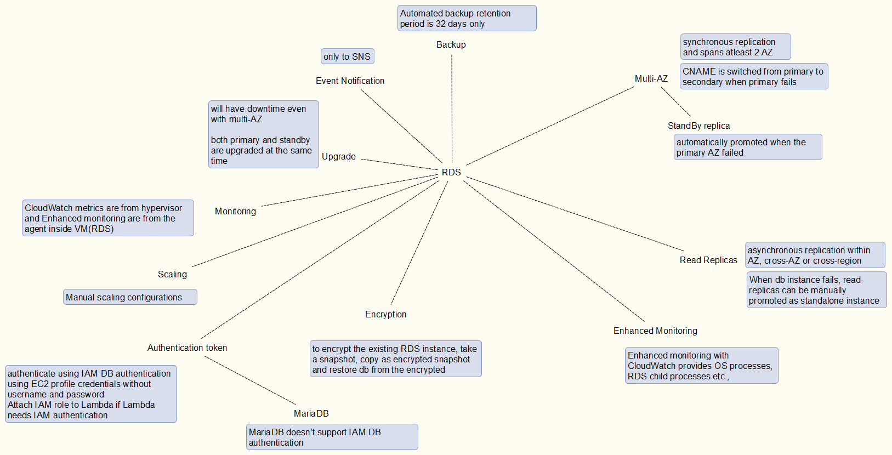
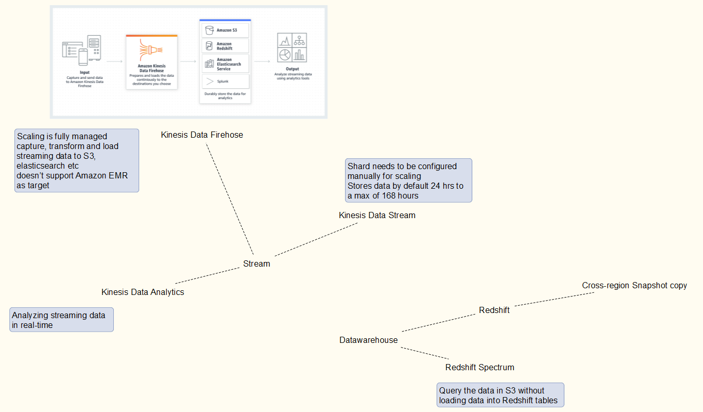
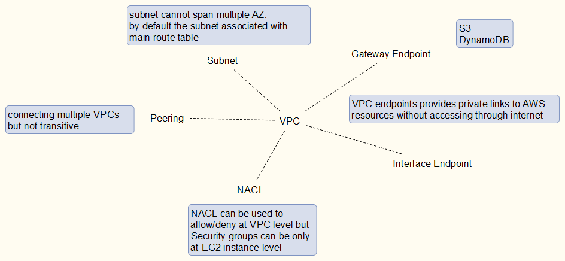

This is my notes for preparing for SAA-C02 exam.
# SAA C02 Notes

I have created notes as kind of MindMap diagram for the AWS services in scope to remember certain features for the preparation of the exam.

## API Gateway

## Aurora

## CloudFormation

## CloudFront

## CloudWatch

## Containerization

## DynamoDB

## EC2

## ElasticCache

## ELB

## Governance

## Hybrid-Network

## IAM

## Lambda

## Messaging

## RDS

## Route53

## Storage

## Stream & BigData

## VPC

