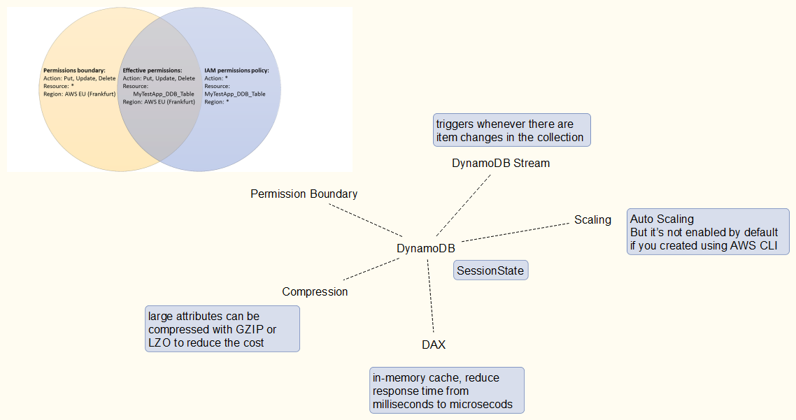
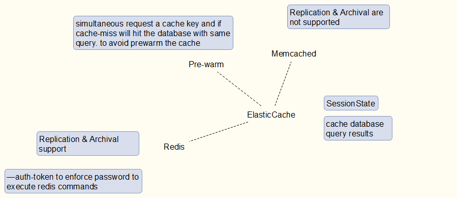
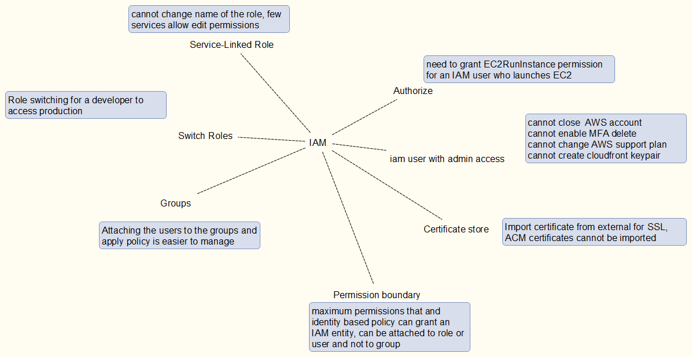
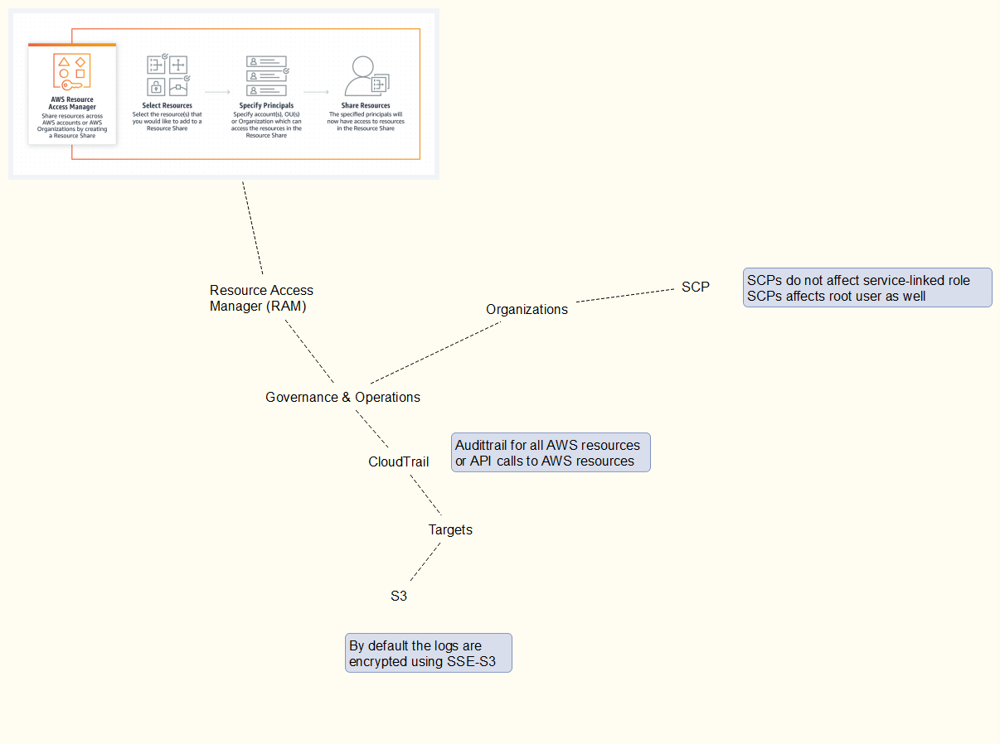

This is my notes for preparing for SAA-C02 exam.
# SAA C02 Notes

I have created notes as kind of MindMap diagram for the AWS services in scope to remember certain features for the preparation of the exam.

## EC2

## Storage

## DynamoDB

## Aurora

## CloudFront

## ECS

## ElasticCache

## IAM

## Messaging

## RDS

## Governance

## VPC

